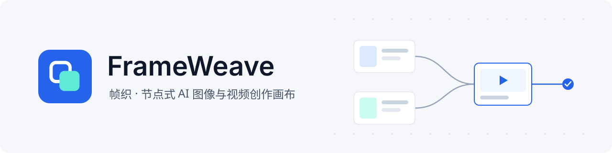
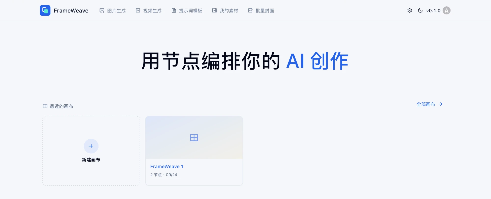
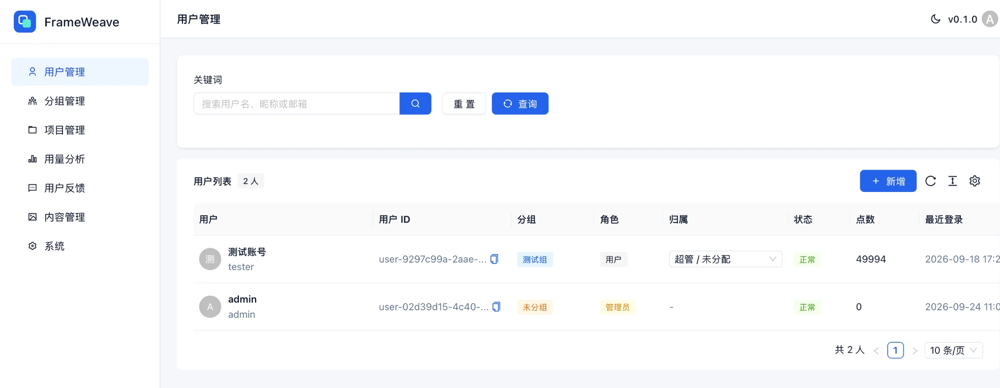
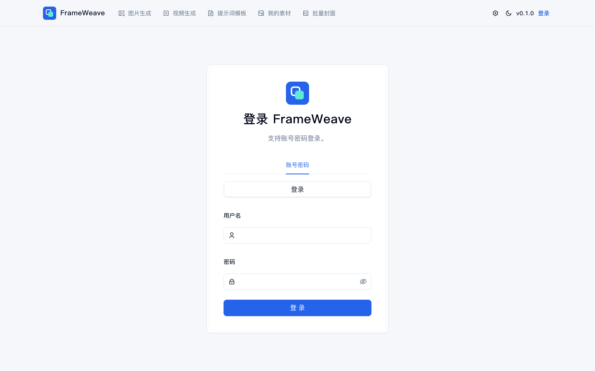
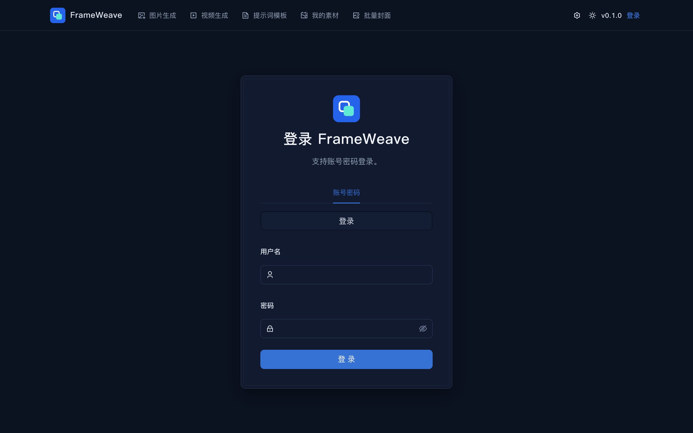
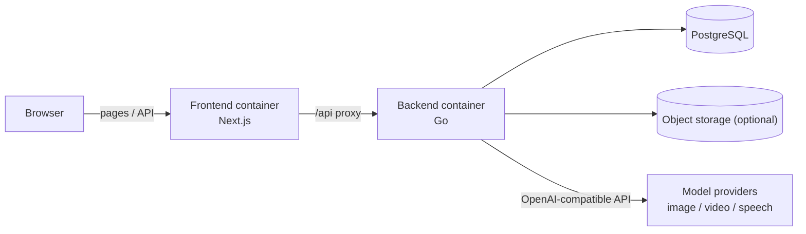

<p align="center">
  
</p>

<p align="center">
  <b>Source available · free for personal and non-commercial use</b> ·
  <a href="LICENSE">PolyForm Noncommercial 1.0.0</a> ·
  <a href="README.md">中文</a>
</p>

---

FrameWeave is an **infinite canvas** for AI creation. You place nodes on the canvas; each node can generate an
image, a video or speech, and the **connections** between nodes say which material is used as a reference for what.
Characters, scenes and shots snap together like building blocks, so one canvas holds an entire creative pipeline:
change an upstream reference and regenerate what comes after it.

It is also a **multi-tenant platform** with users, groups (teams) and projects, credit metering and a full admin
console, built for teams that want to run it on their own servers.

> The user interface and the documentation are currently in Chinese.

## Screenshots

<p align="center">
  
</p>

<p align="center">
  
</p>

<table>
  <tr>
    <td width="50%"></td>
    <td width="50%"></td>
  </tr>
</table>

## Features

- **Canvas**: drag, group and connect nodes; one-click layout (grid, by type, by dependency, by name); undo and redo;
  shareable links; administrators can browse and restore up to 30 snapshots of any canvas
- **Images**: text-to-image, image-to-image and multi-image references, priced per quality tier (1K / 2K / 4K)
- **Video**: text-to-video, image-to-video, first/last frame, reference-to-video, video edit and video extend,
  chosen explicitly on each node
- **Audio**: text-to-speech, plus speaking new lines in the voice of a reference clip
- **3D stage**: pose characters and props in a 3D scene, set up cameras, and send stills or camera moves back to the canvas
- **In-canvas assistant**: arrange nodes, edit prompts and start generations in natural language;
  anything that spends credits asks for confirmation first
- **Assets and prompts**: personal library, team-shared assets, prompt templates and favorites, shared style presets
- **Admin console**: users, groups and projects; per-group model channels and storage; credit adjustments and ledger;
  tiered pricing; generation statistics; task logs; feedback; content and system settings

## Architecture



Go backend, Next.js frontend, PostgreSQL 18, S3-compatible object storage (tested with Volcengine TOS; media falls
back to local disk when none is configured), deployed with Docker Compose as two containers plus an external database.

## Quick start

You need a Linux server with Docker and a PostgreSQL 18 database. Object storage is optional but strongly recommended.

```bash
git clone <repository-url> frameweave
cd frameweave
bash deploy/deploy.sh init --env prod        # generate config files, then fill them in
bash deploy/deploy.sh build-base all         # build the dependency base images (once)
bash deploy/deploy.sh build --env prod all   # build the app images
bash deploy/deploy.sh up --env prod all      # start
```

A fresh install has no models. Sign in with the administrator account from your config, add a **model channel**
(base URL, API key and model names) to a group under group management, then set a **price** for each model under
tiered pricing. Models are connected through the **OpenAI-compatible API**; speech also supports Volcengine's
Doubao speech protocol.

> Mount each video model on **one** channel only. Video jobs are asynchronous and status checks pick a channel by
> model name again, so a second channel may not know the job and it gets marked as failed and refunded.

See the [deployment guide](docs/部署指南.md) (Chinese) for the full procedure, reverse proxy example, upgrades and backups.

## Documentation

- [Deployment guide](docs/部署指南.md): requirements, first deployment, model channels, operations, FAQ
- [Developer guide](docs/开发者指南.md): architecture, data flow, billing design, extension guide, known issues
- [Changelog](CHANGELOG.md), [Contributing](CONTRIBUTING.md), [Security](SECURITY.md)

## License

FrameWeave is released under the [PolyForm Noncommercial License 1.0.0](LICENSE). You may use, modify and share it
for any **noncommercial** purpose, including personal study, research and hobby projects, and it may be used by
noncommercial organizations such as charities, schools and public research institutions.
**Commercial use is not permitted**, including offering it as a paid service or as part of a commercial product.
For commercial licensing, please obtain written permission from the authors.

Third-party components keep their own licenses; see [THIRD-PARTY-NOTICES.txt](THIRD-PARTY-NOTICES.txt).
