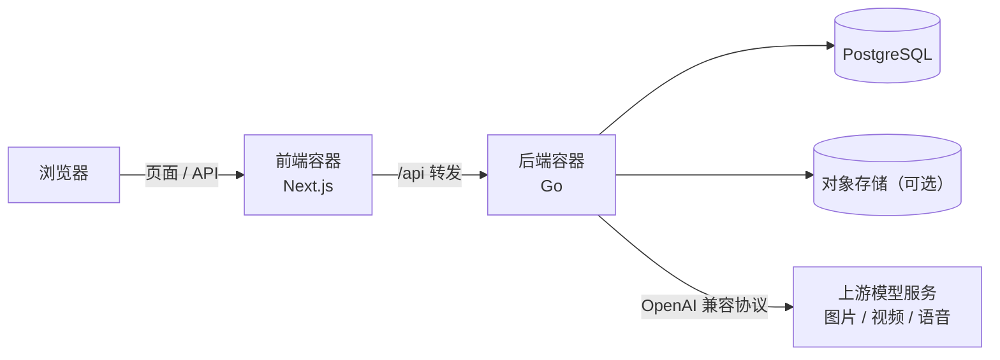

<p align="center">
  
</p>

<p align="center">
  <b>源码公开 · 个人与非商业免费使用</b> ·
  <a href="LICENSE">PolyForm Noncommercial 1.0.0</a> ·
  <a href="README.en.md">English</a>
</p>

---

FrameWeave（帧织）是一块**无限画布**：在画布上摆放节点，每个节点可以生成图片、视频或语音，
节点之间的**连线**表达「谁是谁的参考素材」。把角色、场景、镜头像积木一样连起来，
一张画布就是一整条创作流程，改了上游的参考图，下游重新生成即可。

它同时是一个**多租户平台**：用户、分组、项目三级隔离，带点数计量和完整的管理后台，
适合团队在自己的服务器上部署使用。

## 界面预览

<p align="center">
  
</p>

<p align="center">
  
</p>

<table>
  <tr>
    <td width="50%"></td>
    <td width="50%"></td>
  </tr>
  <tr>
    <td align="center">浅色主题</td>
    <td align="center">深色主题</td>
  </tr>
</table>

## 能做什么

**画布**
- 节点拖拽、编组、连线，一键排序（网格 / 按类型 / 按依赖关系 / 按名称）
- 撤销 / 重做；画布可生成分享链接；管理员可在后台查看任意画布的历史快照（最多 30 个版本）并恢复
- 节点可自定义名称，参考素材在提示词里用 `@名称` 引用
- 画布内 AI 助手：用自然语言让它帮你摆节点、改提示词、发起生成（涉及扣点的操作会先让你确认）

**生成**
- **图片**：文生图、图生图、多图参考，按画质档（1K / 2K / 4K）分别计价
- **视频**：文生视频、图生视频、首尾帧、参考生视频、视频编辑、视频延长，六种模式在节点上显式选择
- **音频**：语音合成；接一段参考音频可以用同样的音色念新台词
- **3D 场景台**：在 3D 场景里摆放人物和道具、设置机位，截图和运镜视频直接回到画布当参考

**素材与协作**
- 个人素材库、团队共享素材，按项目筛选
- 提示词模板库、收藏、按分类检索
- 自定义风格预设，可在团队内共享
- 图片标注、九宫格多机位、批量封面等辅助工具

**管理后台**
- 用户、分组（团队）、项目三级管理，按分组配置模型渠道与存储
- 点数调整与流水、分级定价、生成统计、任务日志
- 用户反馈、内容管理、系统设置

## 架构



- **前端**：Next.js + React，画布为自研实现；UI 组件基于 Ant Design 与 Tailwind CSS
- **后端**：Go，负责鉴权、计费、任务调度、媒体转存与上游代理
- **数据库**：PostgreSQL 18，表结构在首次启动时自动创建
- **存储**：兼容 S3 协议的对象存储（推荐；按火山引擎 TOS 验证过，其它 S3 兼容存储未逐一验证）；不配置时媒体文件落本机磁盘
- **部署**：Docker Compose，前后端各一个容器，数据库使用外部实例

## 快速开始

需要一台装有 Docker 的 Linux 服务器，以及一个 PostgreSQL 18 数据库。对象存储可选，但强烈建议一开始就配好。

```bash
git clone <仓库地址> frameweave
cd frameweave

# 1. 生成配置文件，然后按部署指南填写数据库、管理员口令等
bash deploy/deploy.sh init --env prod

# 2. 构建依赖基础镜像（只需一次；依赖变化时重做）
bash deploy/deploy.sh build-base all

# 3. 构建并启动
bash deploy/deploy.sh build --env prod all
bash deploy/deploy.sh up --env prod all
```

首次启动后系统是一个空项目，还需要两步才能开始生成：

1. 用配置里的管理员账号登录后台，在「分组管理」里为分组添加**模型渠道**（BaseURL + API Key + 模型名）
2. 在「系统 → 分级定价」里给各模型设置**单价**

完整步骤、Nginx 反向代理示例、升级与备份，见 [部署指南](docs/部署指南.md)。

## 接入模型

模型通过 **OpenAI 兼容协议**接入：在后台填写渠道的 BaseURL 和 API Key，再列出这个渠道提供的模型名即可。
一个分组可以配置多个渠道。语音合成另外支持火山引擎豆包语音的原生协议。

> ⚠️ **同一个视频模型不要同时挂在多个渠道上。** 视频是异步任务，查询进度时会按模型名重新挑渠道，
> 挑到另一家就查不到这个任务，会被误判为失败并退点。详见[开发者指南](docs/开发者指南.md)的「已知问题与限制」。

> 模型服务的费用由你自己的账号承担，与本项目无关。

## 文档

| 文档 | 内容 |
|---|---|
| [部署指南](docs/部署指南.md) | 环境要求、首次部署、配置模型渠道、日常运维、常见问题 |
| [开发者指南](docs/开发者指南.md) | 架构、数据流、计费设计、二次开发手册、已知问题 |
| [更新日志](CHANGELOG.md) | 各版本变化 |
| [参与贡献](CONTRIBUTING.md) | 提交 Issue 与 Pull Request 的约定 |
| [安全问题](SECURITY.md) | 如何私下报告漏洞、部署安全清单 |

## 许可

本项目按 [PolyForm Noncommercial License 1.0.0](LICENSE) 发布，以英文原文为准。简单说：

- 个人学习、研究、爱好项目等**非商业用途**，可以免费使用、修改和分发
- 非营利机构（公益组织、学校、公共研究机构、政府机关）可以免费使用
- **任何商业用途都不允许**，包括用它对外提供收费服务、或作为商业产品与服务的组成部分

如需商业使用，请先取得作者的书面授权。

## 致谢

FrameWeave 基于 basketikun 的开源项目 [infinite-canvas](https://github.com/basketikun/infinite-canvas)（MIT 许可）二次开发，特此向原作者致谢。

本项目还使用了以下基础项目、第三方组件与素材，各自适用其原始许可条款，详见 [THIRD-PARTY-NOTICES.txt](THIRD-PARTY-NOTICES.txt)：

- [infinite-canvas](https://github.com/basketikun/infinite-canvas)：本项目的上游基础项目（MIT）
- [Remix Icon](https://remixicon.com)：界面图标
- 「3D 导演台」：3D 场景台的内嵌组件（MIT）
- [Ant Design](https://ant.design)、[Next.js](https://nextjs.org)、[Tailwind CSS](https://tailwindcss.com) 等开源项目
